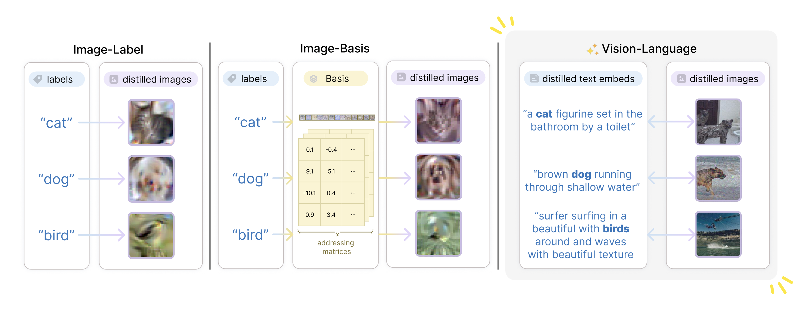
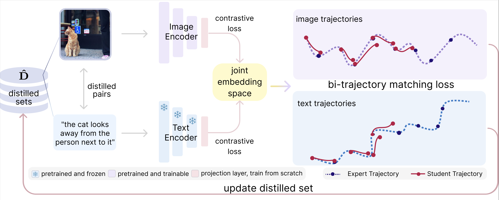

# Vision-Language Dataset Distillation

### [Project Page](https://princetonvisualai.github.io/multimodal_dataset_distillation/) | [Paper](https://arxiv.org/abs/2308.07545)


This codebase is for the paper [Vision-Language Dataset Distillation](https://arxiv.org/abs/2308.07545). Please visit our [Project Page](https://princetonvisualai.github.io/multimodal_dataset_distillation/) for detailed results.


Dataset distillation methods offer the promise of reducing a large-scale dataset down to a significantly smaller set of (potentially synthetic) training examples, which preserve sufficient information for training a new model from scratch. So far dataset distillation methods have been developed for image classification. However, with the rise in capabilities of vision-language models, and especially given the scale of datasets necessary to train these models, the time is ripe to expand dataset distillation methods beyond image classification. 



In this work, we take the first steps towards this goal by expanding on the idea of trajectory matching to create a distillation method for vision-language datasets. We demonstrate significant improvements on the challenging Flickr30K and COCO retrieval benchmarks: for example, on Flickr30K the best coreset selection method which selects 1000 image-text pairs for training is able to achieve only 5.6% image-to-text retrieval accuracy (i.e., recall@1); in contrast, our dataset distillation approach almost doubles that to 9.9% with just 100 (an order of magnitude fewer) training pairs.


## Getting Started
[Adapted from [mtt-distillaion](https://github.com/GeorgeCazenavette/mtt-distillation) by [George Cazenavette](https://georgecazenavette.github.io) et al.]
First, download our repo:
```bash
git clone https://github.com/princetonvisualai/multimodal_dataset_distillation.git
cd multimodal_dataset_distillation
```

For an express instillation, we include ```.yaml``` files.

You need a RTX 30XX GPU (or newer), and run

```bash
conda env create -f requirements.yaml
```

You can then activate your  conda environment with
```bash
conda activate vl-distill
```

## Datasets and Annotations
Please download images for the Flickr30K and COCO datasets, create separate directories for the annotations, linked below.

Flickr30K: [[Train]](https://storage.googleapis.com/sfr-vision-language-research/datasets/flickr30k_train.json)[[Val]](https://storage.googleapis.com/sfr-vision-language-research/datasets/flickr30k_val.json)[[Test]](https://storage.googleapis.com/sfr-vision-language-research/datasets/flickr30k_test.json)[[Images]](https://www.kaggle.com/datasets/hsankesara/flickr-image-dataset)

COCO: [[Train]](https://storage.googleapis.com/sfr-vision-language-research/datasets/coco_karpathy_train.json)[[Val]](https://storage.googleapis.com/sfr-vision-language-research/datasets/coco_karpathy_val.json)[[Test]](https://storage.googleapis.com/sfr-vision-language-research/datasets/coco_karpathy_test.json)[[Images]](https://cocodataset.org/#download)

## Training Expert Trajectories
The following command generates 20 expert trajectories using NFNet image encoder and BERT text encoder. Traing is done on the Flickr30K dataset, by simultaneously finetuning a pre-trained NFNet model while training a projection layer over the a frozen pre-trained BERT.
```bash
python buffer.py --dataset=flickr --train_epochs=10 --num_experts=20 --buffer_path={path_to_buffer} --image_encoder=nfnet --text_encoder=bert --image_size=224 --image_root={path_to_image_directory} --ann_root={path_to_annotation_directory}
```

## Bi-Trajectories Guided Co-Distillation
The following command distills 100 synthetic samples for the Flickr30K dataset given the expert trajectories.
```bash
python distill.py --dataset=flickr --syn_steps=8 --expert_epochs=1 --max_start_epoch=2 --lr_img=1000 --lr_txt=1000 --lr_lr=1e-02 --buffer_path={path_do_buffer} --num_queries 100 --image_encoder=nfnet --text_encoder=bert --draw True --image_root={path_to_image_directory} --ann_root={path_to_annotation_directory} --save_dir={path_to_saved_distilled_data}
```

## Acknowledgements
This material is based upon work supported by the National Science Foundation under Grant No. 2107048. Any opinions, findings, and conclusions or recommendations expressed in this material are those of the author(s) and do not necessarily reflect the views of the National Science Foundation. We thank many people from Princeton Visual AI lab (Allison Chen, Jihoon Chung, Tyler Zhu, Ye Zhu, William Yang and Kaiqu Liang) and Princeton NLP group (Carlos E. Jimenez, John Yang), Tiffany Ling and  George Cazenavette for their helpful feedback on this work.

## Citation
```
@article{wu2023multimodal,
  title={Multimodal Dataset Distillation for Image-Text Retrieval},
  author={Wu, Xindi and Zhang, Byron and Deng, Zhiwei and Russakovsky, Olga},
  journal={arXiv preprint arXiv:2308.07545},
  year={2023}
}
```

## TODO
LoRA matching part coming soon
